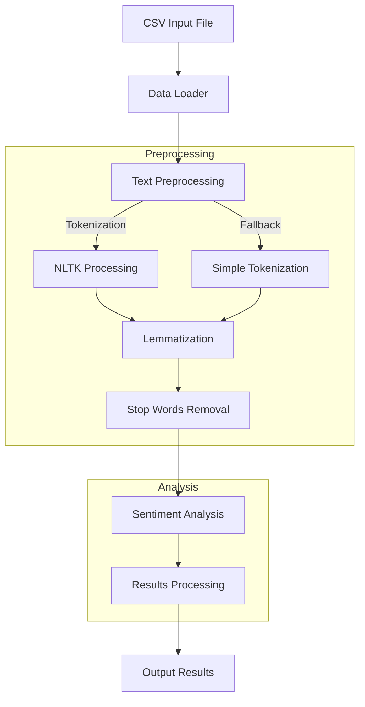

# Public Service Sentiment Analysis

A Flask web application for analyzing sentiment in public service feedback.

## Setup

1. Clone the repository:
```bash
git clone https://github.com/yourusername/public-service-sentiment.git
cd public-service-sentiment
```

2. Install dependencies:
```bash
pip install -r requirements.txt
```

3. Run the application:
```bash
python src/web/app.py
```

## Features

- **Feedback Analysis**: Analyze user feedback to determine sentiment polarity (positive, negative, neutral).
- **Aspect-Based Sentiment Analysis**: Identify specific aspects of services that are being commented on and their associated sentiments.
- **Data Ingestion**: Load and preprocess data from various sources for analysis.
- **Visualization**: Visualize sentiment trends and insights.

## How It Works



### Process Flow:
1. **Data Input**: Load feedback data from CSV file
2. **Preprocessing**:
   - Tokenize text into words
   - Lemmatize words to their base form
   - Remove stop words
3. **Analysis**:
   - Calculate sentiment scores
   - Generate polarity metrics
4. **Output**:
   - Display sentiment analysis results
   - Show statistics and trends

## Installation

Choose one of these installation methods:

### Simple Installation
```bash
# Install directly
pip install -r requirements.txt

# OR install for current user only
pip install --user -r requirements.txt
```

### Using Virtual Environment (recommended for development)
```bash
# Create and activate virtual environment
python -m venv venv
# On Windows:
venv\Scripts\activate
# On Unix or MacOS:
source venv/bin/activate

# Install dependencies
pip install -r requirements.txt
```

## Usage

To run the application, execute the following command:

```bash
python src/main.py
```

This will initiate the workflow of data ingestion, sentiment analysis, and visualization.

## Testing

To run the unit tests, use the following command:

```bash
pytest tests/
```

## Detailed Project Guide

### 1. Project Structure
```
public-service-sentiment/
├── data/                      # Data files
│   └── sample_feedback.csv    # Sample feedback data
├── src/                       # Source code
│   ├── analyzer/             # Sentiment analysis components
│   │   ├── feedback_analyzer.py
│   ├── data/                # Data handling
│   │   ├── data_loader.py
│   ├── utils/               # Utility functions
│   │   ├── text_preprocessor.py
│   └── web/                 # Web interface
│       ├── app.py          # Flask application
│       ├── static/         # CSS files
│       └── templates/      # HTML templates
├── tests/                   # Unit tests
└── requirements.txt         # Project dependencies
```

### 2. How the Code Works

#### Step 1: Data Input
- Users upload a CSV file containing feedback comments
- The file must have a 'feedback' column
- Sample format:
  ```csv
  feedback
  "The service was excellent"
  "Need improvement in response time"
  ```

#### Step 2: Text Processing
1. **Tokenization**: Breaks text into words
   - Example: "The service was excellent" → ["The", "service", "was", "excellent"]
2. **Lemmatization**: Converts words to base form
   - Example: "running" → "run"
3. **Stop Words Removal**: Removes common words
   - Example: removes "the", "was", etc.

#### Step 3: Sentiment Analysis
1. **VADER Sentiment Analysis**
   - Calculates positive, negative, neutral scores
   - Determines compound sentiment score (-1 to +1)
2. **Emotion Classification**
   - Happy: Very positive (score ≥ 0.5)
   - Angry: Very negative (score ≤ -0.5)
   - Disappointed: Slightly negative
   - Satisfied: Slightly positive
   - Neutral: Neither positive nor negative

#### Step 4: Visualization
1. **Dashboard Statistics**
   - Total feedback count
   - Positive/Negative percentages
   - Average sentiment score
2. **Interactive Charts**
   - Pie chart: Sentiment distribution
   - Bar chart: Emotion counts
   - Timeline: Sentiment trends

### 3. Key Components Explained

#### FeedbackAnalyzer (feedback_analyzer.py)
- Main class for sentiment analysis
- Uses NLTK's VADER sentiment analyzer
- Processes text and returns sentiment scores

#### Text Preprocessor (text_preprocessor.py)
- Handles text cleaning and preparation
- Downloads required NLTK resources
- Provides fallback methods if NLTK fails

#### Web Interface (web/app.py)
- Flask web application
- Handles file uploads
- Displays interactive dashboard
- Shows detailed analysis results

### 4. Common Questions and Answers

Q: How does the sentiment scoring work?
A: Uses VADER (Valence Aware Dictionary and sEntiment Reasoner)
   - Scores range from -1 (most negative) to +1 (most positive)
   - Considers intensity and context of words

Q: What makes a comment "positive" vs "negative"?
A: 
- Positive: score > 0 (example: "excellent service")
- Negative: score < 0 (example: "poor response")
- Neutral: score = 0 (example: "service center opens at 9")

Q: How accurate is the analysis?
A: VADER is specifically tuned for social media and short texts
   - Generally 70-80% accurate for social media content
   - Better at detecting strong emotions than subtle ones

### 5. Running the Project

1. **Setup Environment**
```bash
# Windows
setup.bat

# Linux/Mac
./setup.sh
```

2. **Run Web Application**
```bash
python src/web/app.py
```

3. **Access Dashboard**
- Open browser: http://localhost:5000
- Upload CSV file
- View analysis results

### 6. Testing

Run the test suite:
```bash
pytest tests/
```

Tests cover:
- Sentiment analysis accuracy
- Text preprocessing
- Data loading
- Error handling

## Contributing

Contributions are welcome! Please open an issue or submit a pull request for any improvements or bug fixes.

## License

This project is licensed under the MIT License. See the LICENSE file for details.